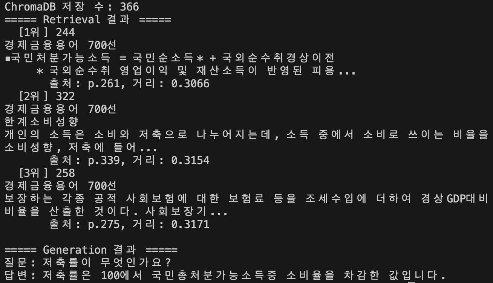

# 6주차 Weekly Challenge Mini Project

| # | 과제 목표 | 진행 |
|---|---|---|
|1| Gemini API (2.5 Flash) 또는 공개 가중치 모델(Qwen, Gemma 등)을 LLM으로 삼아 문서 로딩부터 응답 생성까지 RAG 아키텍처를 구축하세요.|✅|
|2| 구축한 RAG 파이프라인을 FastAPI로 래핑하여 REST API로 배포해 보세요. (선택: 스트리밍)|✅|
|3| 구축한 RAG 파이프라인을 평가해 보세요. (RAGAS 등 활용) |🔜|
|4| (선택) Graph RAG을 알아보고 적용해보세요.  |🔜|

---
### 파일 구조 1.
```
week6_miniproject/
├── app.py          REST API
├── generation.py
├── indexing.py
└── main.py   

```

---
### 실행 결과
