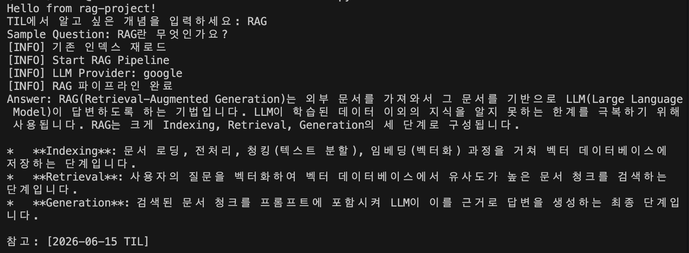

# 7주차 Weekly Challenge

| # | 과제 목표 | 진행 |
|---|---|---|
|1| 개인 프로젝트에 LangChain 기반으로 RAG 파이프라인을 구축|✅|
|2| LangChain 기반 RAG 파이프라인을 FastAPI로 래핑하여 REST API로 배포|✅|
|3|LangSmith로 체인 실행을 Tracing하고 Dataset 기반으로 평가|✅|

---
### 파일 구조
```
week7/
├── app.py          REST API
├── main.py         LangChain 단일 테스트 또는 LangSmith 평가 실행
└── langchainfile/
    ├── eval.py     LangSmith 평가
    └── rag.py      LangChain
```
---
### RAG 시스템 간단 설명
- 주제 : TIL 검색 RAG System using LangChain
- 내용 : TIL(Today I Learned)을 작성해둔 문서들(.md)을 이용하여 정리해둔 개념의 정의와 사용 이유 등을 간편히 찾을 수 있다.
---
### RAG 문서
- TIL.md 파일
- 지금까지 배운 강의 TIL 정리 마크다운 파일들을 사용하였다.
- 내가 정리해둔 언어로 개념에 대한 정의 검색이 가능한 모델 구현

---
### 실행 방법

#### LangChain 단일 검색 : 정해진 쿼리
```
uv run main.py --mode chaintest
```
```
TIL에서 알고 싶은 개념을 입력하세요:
>>
```



#### REST API
```
uvicorn app:app

스웨거 문서로 확인
http://localhost:8000/docs

query에 질문을 문장으로 입력
```

#### LangSmith 평가 (미완성)
```
uv run main.py --mode eval
```
---

---
### 코드 참고 출처
- Alex RAG 코드를 참고하여 서브 퀘스트를 달성함
- 서브 퀘스트
    1. 인덱싱을 매번 하지 않고 인덱싱 결과를 파일이나 영속성 있게 저장한다.
    2. 평가하는 llm이 generation하는 llm과 동일한 상태인데
평가 LLM을 평가 대상 LLM보다 성능이 좋은 모델로 변경한다.

---
### 문제 상황
- eval 파트 실행이 잘 안됨.
- colab에서 코드 실행했을때보다 자주 LLM resources exhausted 가 발생하는 것 같다.
```
Error calling model 'gemini-2.5-flash-lite' (RESOURCE_EXHAUSTED): 429 RESOURCE_EXHAUSTED. {'error': {'code': 429, 'message': 'You exceeded your current quota, please check your plan and billing details.
```
- colab 기준: langchain 패키지들 설치시, import가 안되는 경우가 있음. (나눠서 설치하거나 다시 설치하면 됨..)
```
!pip install -q langchain langchain-google-genai langchain-chroma
!pip install -q langchain-community langchain-text-splitters
```

- 문서에서 검색하지 않고 자체적으로 검색하여 대답하는 문제
    - -> 프로젝트 폴더를 옮기는 과정에서 VectorDB파일이 제대로 옮겨지지 않아서 그런듯하다.
    - -> 해결: 인덱싱 처음부터 하고 Vector DB 재생성

---
### 추가 필요한 부분
- 평가하는 LLM이 평가 대상 LLM과 동일한 상황
    - 다른 LLM 사용 가능하도록 수정하기 완료.
    - 그러나 어떤 LLM을 사용해도 좋을지 정하지 못하여 일단 같은 LLM으로 구현해둠.

---
### 회고
#### 1. 배운점
- 깃 연동 테스트

#### 2. 어려웠던 점

#### 3. 최종 회고
